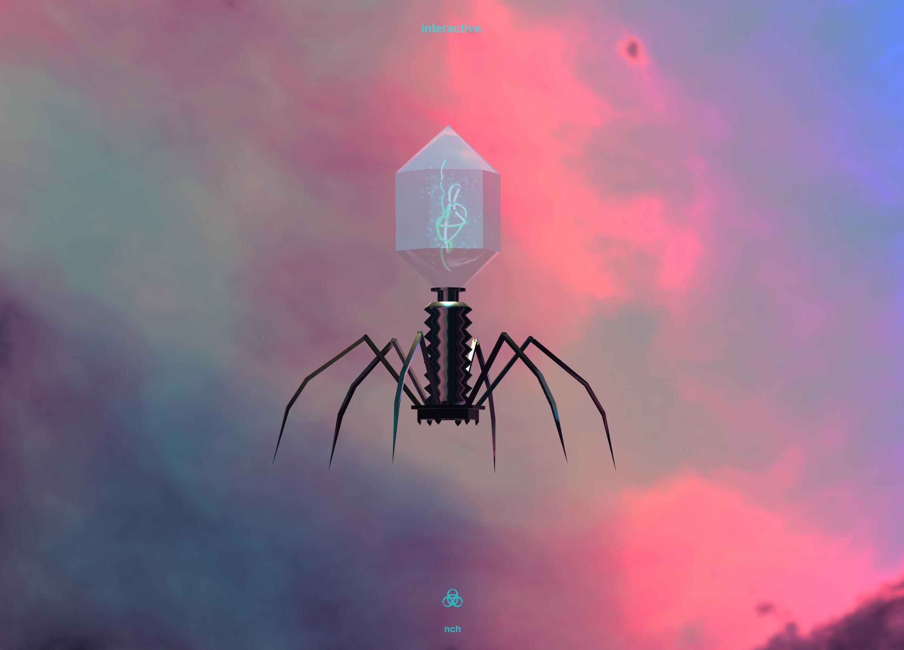
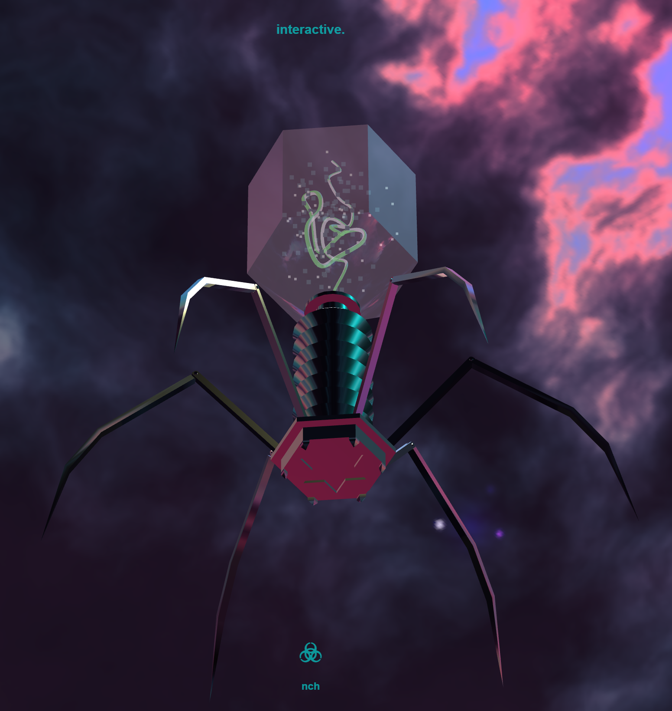
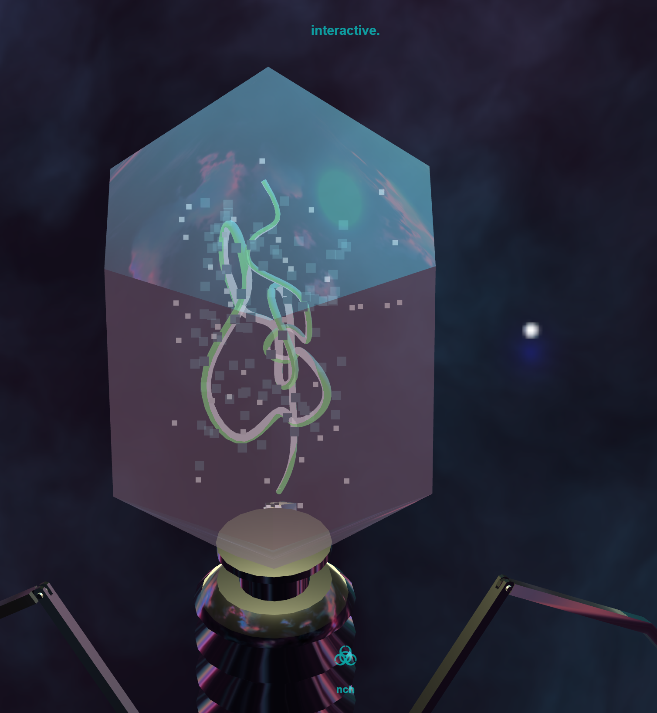
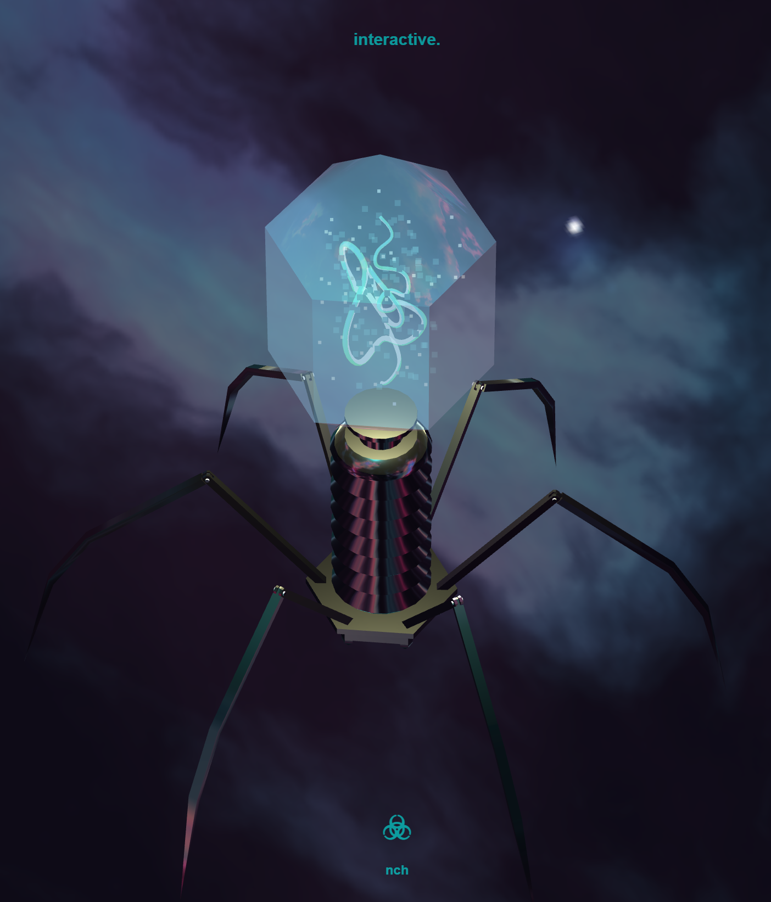

  
Nathalie Claire Huppert,  Computer Graphics

  <h1>Bacteriophage Project Three.js</h1>

 

  

  

## Topic
For my project, I wanted to create a bacteriophage because I had looked at some projects on the Three.js website for inspiration and wanted something where I could include an HDRI texture and an object with a reflective material.

## Process
First I created the bacteriophage in Maya. My plan was to create the head, DNA, and all legs as separate objects so that I could assign different materials to them after importing them into Three.js. Also, I wasn't sure if I could animate each leg separately if I import the whole body as just one big object.
Then I already encountered my first problem: according to the book "discover Three.js" glTF is the best format to use 3D objects on the web, but in Maya a glTF export was not possible. I looked at some plugins on the web, but there was no plugin that supported exporting each object individually, so I solved the problem by importing each object into Blender and exporting it from there again in glTF format.

After successfully importing all the objects into Three.js, I found that even though they were all in the same place and I had set the pivot points in Maya/Blender just right, some of the objects seemed to be in the wrong place after the import and I had to manually move them to the right place, which was a bit tedious. 
I then assigned the materials to the objects, which was relatively easy by comparison, and also figured out how to add an HDRI texture as a background and a map for the reflections. 
I also created some lights and some orbit controls to automatically rotate the camera and prevent zooming into or too far away from the bacteriophage.
I also made random particles inside the bacteriophage head to create a glow effect and make the model more interesting.

Then it was time to animate the parts. My goal was to get some of the particles to rotate, giving the impression that they were floating around. This wasn't particularly difficult, but when I wanted to make the DNA rotate in exactly the same way (around the y-axis), it took me a while to figure out that the pivot was somehow off, even though I had taken extra care in the 3D animation software to set it correctly. To fix this problem, I created a box as a parent node and assigned the DNA as a child to it so it could rotate around the y-axis, and finally it worked!
My next plan was to create a hitbox to each of the legs, so that when a leg (or near a leg) is clicked, a little animation plays with an event listener. (my plan was that when it was clicked, it should move up quickly and then slowly return to the original position). I wanted to achieve the animation with a transformation matrix.
Unfortunately, I had a little too much planned for the time I had available, and so I didn't finish it completely in time. Therefore I only created the hitboxes.

If I had had more time, my next steps would have been to add the event listeners to the legs and create a small animation for each of them, and also to improve the overall performance of my project. because as I find, it takes quite a long time to load the whole animation, although it runs smoothly afterwards. So my idea was to reduce the quality of my HDRI texture in Photoshop, because that seems to be the main problem.

  

  
  
  

  

## Conclusion
I have learned a lot about Three.js in the last weeks and it was very interesting and fun to get a better insight. I can definitely see myself improving my project in the future and even plan to do more complex projects in Three.js!
